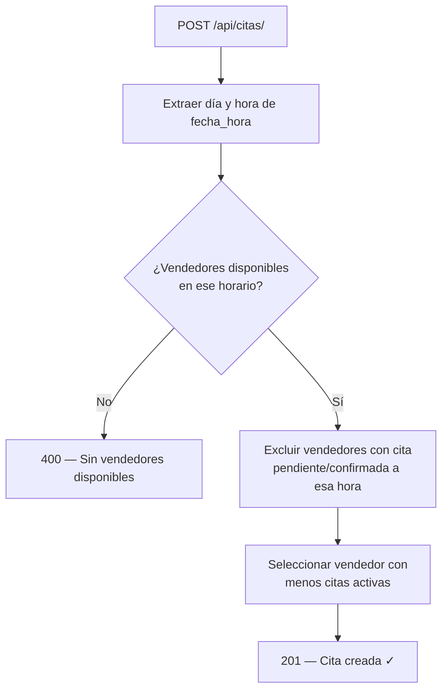
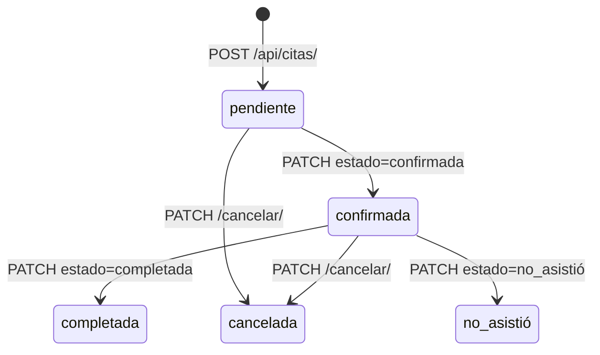
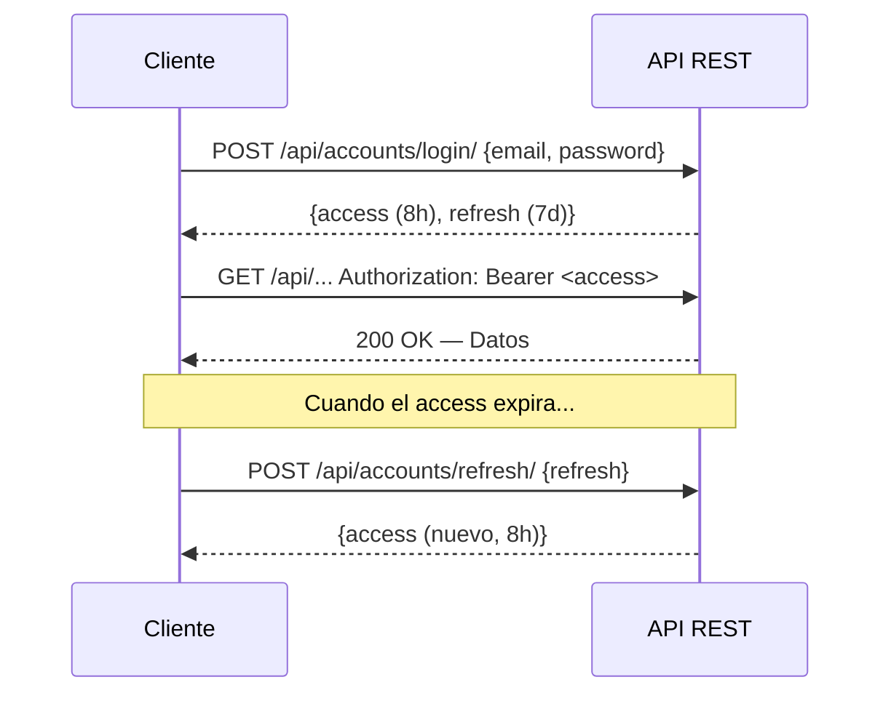

#  API REST — Endpoints

> **Base URL:** `http://localhost:8000/api/`  
> **Autenticación:** JWT Bearer tokens via `SimpleJWT`  
> **Formato:** JSON (salvo endpoints multipart para imágenes)

---

##  Mapa General de la API

```
/api/
 ├── accounts/   → Autenticación, perfiles, gestión de usuarios
 ├── autos/      → Catálogo de vehículos, categorías e imágenes
 ├── vendedores/ → Perfiles de vendedores y disponibilidad
 └── citas/      → Agendamiento y gestión de citas
```

---

##  Niveles de Acceso

| Símbolo       | Significa              |
|---------------|------------------------|
| 🌐 Público    | Sin autenticación      |
| 🔒 Autenticado | Cualquier usuario con token válido |
| 👤 Cliente    | Rol `cliente`          |
| 🏷️ Vendedor  | Rol `vendedor`         |
| 🛡️ Admin     | Rol `admin` / staff    |

---

##  Métodos HTTP

| Método   | Color semántico | Uso típico        |
|----------|----------------|-------------------|
| `GET`    | 🟢 Seguro       | Consultar datos   |
| `POST`   | 🔵 Crear        | Crear recurso     |
| `PUT`    | 🟡 Reemplazar   | Actualizar completo |
| `PATCH`  | 🟠 Modificar    | Actualizar parcial |
| `DELETE` | 🔴 Eliminar     | Borrar recurso    |

---

##  Documentación Interactiva

| URL | Herramienta | Acceso |
|-----|-------------|--------|
| [`/api/docs/`](http://localhost:8000/api/docs/) | Swagger UI interactivo | 🌐 Público |
| [`/api/redoc/`](http://localhost:8000/api/redoc/) | ReDoc (documentación estática) | 🌐 Público |
| [`/api/schema/`](http://localhost:8000/api/schema/) | Esquema OpenAPI JSON/YAML | 🌐 Público |
| [`/admin/`](http://localhost:8000/admin/) | Panel admin Django | 🛡️ Staff |

---

## 👤 `accounts` — `/api/accounts/`

###  Autenticación

| Método | URL | Descripción | Acceso | Body | Respuesta |
|--------|-----|-------------|--------|------|-----------|
| `POST` | `/api/accounts/register/` | Registro de nuevo cliente | 🌐 | `{email, password, password2, first_name, last_name, telefono}` | `201` datos del usuario |
| `POST` | `/api/accounts/login/` | Obtener tokens JWT | 🌐 | `{email, password}` | `200 {access, refresh}` |
| `POST` | `/api/accounts/refresh/` | Refrescar access token | 🌐 | `{refresh}` | `200 {access}` |

###  Perfil

| Método | URL | Descripción | Acceso | Body | Respuesta |
|--------|-----|-------------|--------|------|-----------|
| `GET` | `/api/accounts/me/` | Datos del usuario autenticado | 🔒 | — | `200` UserSerializer |
| `PUT` / `PATCH` | `/api/accounts/me/` | Actualizar perfil | 🔒 | `{first_name, last_name, telefono}` | `200` UserSerializer |
| `GET` | `/api/accounts/mi-perfil-cliente/` | Perfil extendido del cliente | 👤 | — | `200` PerfilClienteSerializer |
| `PATCH` | `/api/accounts/mi-perfil-cliente/` | Actualizar dirección y ciudad | 👤 | `{direccion, ciudad}` | `200` PerfilClienteSerializer |

> 💡 `UserSerializer` incluye el campo computado `perfil_cliente` (objeto con `direccion`, `ciudad`, `fecha_creacion`) cuando `rol=cliente`, `null` en caso contrario.

###  Administración de Usuarios

| Método | URL | Descripción | Acceso | Body | Respuesta |
|--------|-----|-------------|--------|------|-----------|
| `GET` | `/api/accounts/users/` | Listar todos los usuarios | 🛡️ | — | `200` lista paginada |
| `GET` | `/api/accounts/users/<id>/` | Detalle de un usuario | 🛡️ | — | `200` UserAdminSerializer |
| `PATCH` | `/api/accounts/users/<id>/` | Cambiar rol / activar | 🛡️ | `{rol, is_active}` | `200` UserAdminSerializer |
| `POST` | `/api/accounts/crear-vendedor/` | Crear usuario vendedor | 🛡️ | `{email, password, first_name, last_name, ...}` | `201` UserSerializer |

---

##  `autos` — `/api/autos/`

###  Vehículos

| Método | URL | Descripción | Acceso | Body | Respuesta |
|--------|-----|-------------|--------|------|-----------|
| `GET` | `/api/autos/vehiculos/` | Listar catálogo de vehículos | 🌐 | — | `200` lista VehiculoSerializer |
| `GET` | `/api/autos/vehiculos/<id>/` | Detalle con imágenes | 🌐 | — | `200` VehiculoSerializer |
| `POST` | `/api/autos/vehiculos/` | Crear vehículo | 🛡️ | `{categoria, marca, modelo, anio, version, precio, ...}` | `201` VehiculoCreateSerializer |
| `PUT` | `/api/autos/vehiculos/<id>/` | Actualizar vehículo | 🛡️ | campos a actualizar | `200` |
| `DELETE` | `/api/autos/vehiculos/<id>/` | Eliminar vehículo | 🛡️ | — | `204` |

###  Imágenes de Vehículo

> Ruta anidada bajo `/api/autos/vehiculos/<id>/`. Usa `SimpleRouter` para no colisionar con `DELETE vehiculos/<id>/`.  
> **Parser:** `MultiPartParser + FormParser` — Almacenamiento en `MEDIA_ROOT/autos/%Y/%m/`

| Método | URL | Descripción | Acceso | Body (multipart) | Respuesta |
|--------|-----|-------------|--------|------------------|-----------|
| `GET` | `/api/autos/vehiculos/<id>/imagenes/` | Listar imágenes | 🛡️ | — | `200` lista ImagenVehiculoSerializer |
| `POST` | `/api/autos/vehiculos/<id>/imagenes/` | Subir imagen | 🛡️ | `imagen` (file), `es_principal`, `orden` | `201` |
| `DELETE` | `/api/autos/vehiculos/<id>/imagenes/<img_id>/` | Eliminar imagen | 🛡️ | — | `204` |

###  Categorías

| Método | URL | Descripción | Acceso | Body | Respuesta |
|--------|-----|-------------|--------|------|-----------|
| `GET` | `/api/autos/categorias/` | Listar categorías | 🌐 | — | `200` lista |
| `POST` | `/api/autos/categorias/` | Crear categoría | 🛡️ | `{nombre, descripcion}` | `201` |
| `PUT` | `/api/autos/categorias/<id>/` | Actualizar categoría | 🛡️ | `{nombre, descripcion}` | `200` |
| `DELETE` | `/api/autos/categorias/<id>/` | Eliminar categoría | 🛡️ | — | `204` |

---

##  `vendedores` — `/api/vendedores/`

###  Listado Público

| Método | URL | Descripción | Acceso | Respuesta |
|--------|-----|-------------|--------|-----------|
| `GET` | `/api/vendedores/lista/` | Listar vendedores activos | 🌐 | `200` lista VendedorPerfilSerializer |
| `GET` | `/api/vendedores/lista/<id>/` | Detalle + disponibilidades | 🌐 | `200` VendedorPerfilSerializer |

###  Perfil Propio (vendedor autenticado)

| Método | URL | Descripción | Acceso | Body | Respuesta |
|--------|-----|-------------|--------|------|-----------|
| `GET` | `/api/vendedores/mi-perfil/` | Perfil profesional propio | 🏷️ | — | `200` VendedorPerfilUpdateSerializer |
| `PATCH` | `/api/vendedores/mi-perfil/` | Actualizar especialidad, biografía, foto | 🏷️ | `{especialidad, biografia, foto}` | `200` |
| `GET` | `/api/vendedores/estadisticas/` | KPIs propios | 🏷️ | — | `200 {citas_pendientes, citas_confirmadas, citas_hoy, citas_completadas_mes, proximas_citas[]}` |

###  Disponibilidad

| Método | URL | Descripción | Acceso | Body | Respuesta |
|--------|-----|-------------|--------|------|-----------|
| `GET` | `/api/vendedores/disponibilidad/` | Mis bloques de disponibilidad | 🏷️ | — | `200` lista |
| `POST` | `/api/vendedores/disponibilidad/` | Crear bloque | 🏷️ | `{dia_semana, hora_inicio, hora_fin}` | `201` |
| `PUT` | `/api/vendedores/disponibilidad/<id>/` | Actualizar bloque | 🏷️ | `{dia_semana, hora_inicio, hora_fin, activo}` | `200` |
| `DELETE` | `/api/vendedores/disponibilidad/<id>/` | Eliminar bloque | 🏷️ | — | `204` |

---

## `citas` — `/api/citas/`

| Método | URL | Descripción | Acceso | Body | Respuesta |
|--------|-----|-------------|--------|------|-----------|
| `GET` | `/api/citas/` | Listar citas (filtrado por rol automáticamente) | 🔒 | — | `200` ver nota de serializer |
| `POST` | `/api/citas/` | Agendar cita (vendedor asignado automáticamente) | 👤 | `{fecha_hora, vehiculo?, motivo?}` | `201` CitaCreateSerializer |
| `GET` | `/api/citas/<id>/` | Detalle de una cita | 🔒 Dueño / 🛡️ | — | `200` CitaSerializer |
| `PATCH` | `/api/citas/<id>/` | Actualizar estatus / notas | 🏷️ / 🛡️ | `{estado, notas_vendedor?}` | `200` CitaEstatusSerializer |
| `PATCH` | `/api/citas/<id>/cancelar/` | Cancelar cita propia | 👤 / 🛡️ | — | `200 {detail, estado}` |

> **Serializer según rol en `GET /api/citas/`:**
> - 🛡️ `admin` / 🏷️ `vendedor` → `CitaSerializer` (completo: datos anidados de cliente, vendedor, vehículo)
> - 👤 `cliente` → `CitaClienteSerializer` (ligero: `vendedor_nombre`, `vehiculo_nombre` como strings)

> ⚠️ **`PATCH /api/citas/<id>/cancelar/`:** Solo válido si la cita está en estado `pendiente` o `confirmada`. El cliente solo puede cancelar sus propias citas; el admin puede cancelar cualquiera.

###  Lógica de Asignación Automática de Vendedor

Al hacer `POST /api/citas/`:



###  Estados de una Cita



---

##  Autenticación JWT

Todas las rutas protegidas requieren el header:

```http
Authorization: Bearer <access_token>
```

### Flujo Completo



###  Duración de Tokens

| Token | Duración |
|-------|----------|
| `access` | 8 horas |
| `refresh` | 7 días |

### ❌ Códigos de Error Comunes

| Código | Significado |
|--------|-------------|
| `400` | Datos de entrada inválidos |
| `401` | Token ausente, expirado o inválido |
| `403` | Sin permiso para esta acción |
| `404` | Recurso no encontrado |
