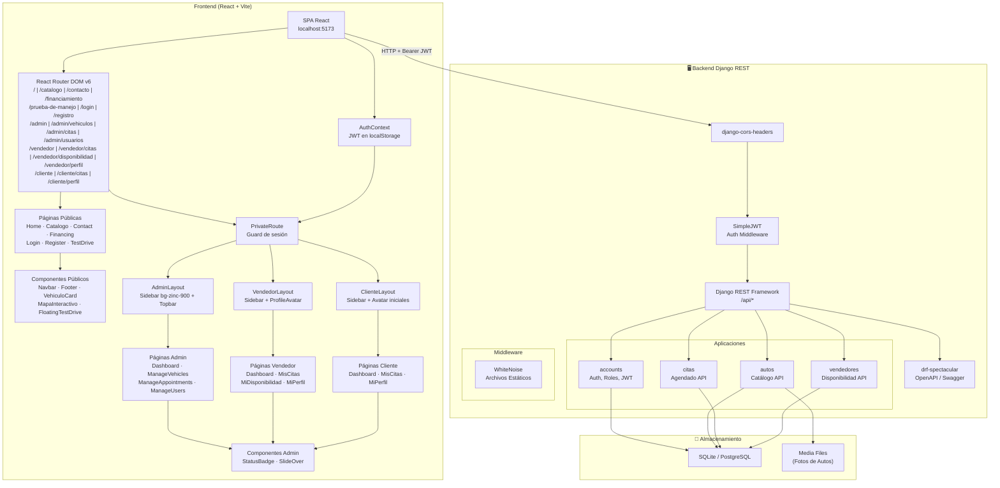
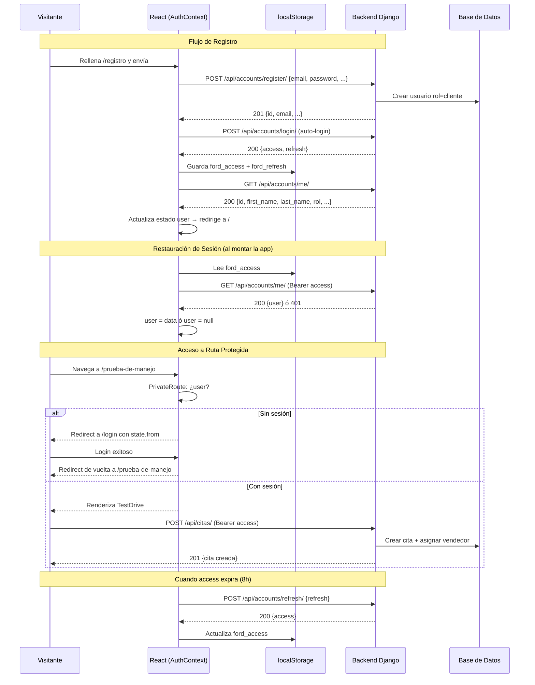

# Arquitectura del Sistema

## Diagrama General



## Flujo de Autenticación JWT



## Descripción de Cada App

### `apps.accounts` — Cuentas y Autenticación

**Responsabilidad:** Gestiona todo lo relacionado con usuarios, autenticación
JWT, registro y asignación de roles.

- Registro de nuevos clientes vía API (`RegisterView`).
- Login JWT con SimpleJWT (`TokenObtainPairView`).
- Modelo de usuario personalizado con campo de rol (cliente, vendedor, admin).
- Modelo `PerfilCliente` creado automáticamente via signal `post_save` al registrar `rol=cliente`.
- Endpoint `me/` para ver/editar perfil propio.
- Endpoint `mi-perfil-cliente/` (GET/PATCH) para datos extendidos del cliente (dirección, ciudad).
- `UserAdminViewSet` para que admin gestione usuarios.
- `CreateVendedorView` para que admin cree vendedores desde el panel.
- Permisos custom: `IsCliente`, `IsVendedor`, `IsAdmin`, `IsVendedorOrAdmin`, `IsOwnerOrAdmin`.

### `apps.autos` — Catálogo de Vehículos

**Responsabilidad:** Administra el catálogo de vehículos disponibles en la
agencia Ford.

- `VehiculoViewSet`: Listado/detalle público, CRUD admin.
- `CategoriaViewSet`: Listado público, CRUD admin.
- `ImagenVehiculoViewSet`: ruta anidada `vehiculos/<id>/imagenes/`, acepta `multipart/form-data`. Registrado con `SimpleRouter` (sin root view) para evitar conflicto 405 en `DELETE vehiculos/<id>/`.
- Serializers diferenciados: lectura (nested) vs escritura (IDs).
- Subida y gestión de imágenes de vehículos (almacenadas en `MEDIA_ROOT/autos/%Y/%m/`).

### `apps.citas` — Sistema de Citas

**Responsabilidad:** Núcleo del sistema — permite a los clientes agendar citas
vía API y a los vendedores/admin gestionarlas.

- `CitaViewSet`: CRUD con permisos por rol.
- **Asignación automática de vendedor**: al crear cita, el sistema busca vendedores disponibles y asigna al de menor carga.
- Filtrado automático por rol: clientes ven sus citas, vendedores las suyas, admin ve todas.
- Serializer diferenciado por rol: `CitaClienteSerializer` (ligero) para clientes, `CitaSerializer` (completo) para vendedor/admin.
- Acción `cancelar` (`PATCH /api/citas/<id>/cancelar/`): valida ownership y estado antes de cancelar.
- Estados: pendiente → confirmada → completada | cancelada | no_asistió.

### `apps.vendedores` — Vendedores y Disponibilidad

**Responsabilidad:** Gestiona los perfiles de vendedores y sus horarios
disponibles para atender citas.

- `VendedorPublicoViewSet`: ReadOnly, listado público de vendedores activos.
- `DisponibilidadViewSet`: CRUD de bloques horarios del vendedor autenticado.
- `MiPerfilVendedorView`: GET/PATCH del perfil profesional propio.
- `EstadisticasVendedorView`: KPIs del vendedor (citas pendientes, hoy, completadas del mes, próximas citas).
- Validación de solapamiento de horarios.

## Flujo General del Sistema

1. **Registro:** `POST /api/accounts/register/` — crea un usuario con rol cliente.
2. **Login:** `POST /api/accounts/login/` — obtiene tokens JWT (access + refresh).
3. **Exploración:** `GET /api/autos/vehiculos/` — catálogo público.
4. **Agendado:** `POST /api/citas/` con `{fecha_hora}` — el backend asigna
   vendedor automáticamente según disponibilidad y carga.
5. **Gestión:** El vendedor cambia el estado vía `PATCH /api/citas/<id>/`.
6. **Cierre:** El vendedor marca la cita como completada.

## Decisiones Técnicas

### ¿Por qué Django 4.2 + Django REST Framework?

- Django 4.2 es una versión **LTS** (soporte hasta abril 2026).
- DRF es el estándar de facto para APIs REST en Django: serializers, viewsets,
  routers, permisos y throttling integrados.
- Separar backend (API) y frontend (React) permite desarrollo paralelo
  y despliegues independientes.

### ¿Por qué JWT (SimpleJWT)?

- Stateless: el servidor no almacena sesiones, ideal para SPAs.
- Access tokens de corta duración (8h) + refresh tokens (7d) para balance
  entre seguridad y UX.
- Compatible con cualquier cliente (web, mobile, Postman).

### ¿Por qué drf-spectacular?

- Genera esquema OpenAPI 3.0 automáticamente desde los ViewSets.
- Swagger UI interactivo para probar endpoints sin frontend.
- ReDoc para documentación estática y legible.

### ¿Por qué CORS con django-cors-headers?

- El frontend React (Vite, puerto 5173) y el backend Django (puerto 8000)
  corren en orígenes distintos en desarrollo.
- CORS controla qué orígenes pueden hacer peticiones al backend.

### ¿Por qué SQLite en desarrollo y PostgreSQL en producción?

- **SQLite** no requiere instalación ni configuración — ideal para desarrollo
  local rápido.
- **PostgreSQL** es robusto, escalable y el estándar en producción. Railway
  ofrece PostgreSQL como add-on nativo.
- Django abstrae las diferencias a través de su ORM, por lo que el cambio
  es transparente.

### ¿Por qué apps separadas por dominio?

- **Separación de responsabilidades:** cada app encapsula un dominio de negocio
  específico.
- **Escalabilidad:** es fácil agregar nuevas apps sin afectar las existentes.
- **Mantenibilidad:** cada equipo o desarrollador puede trabajar en una app
  sin conflictos.

### ¿Por qué WhiteNoise?

- Sirve archivos estáticos directamente desde Django sin necesidad de Nginx.
- Perfecto para deploys en plataformas PaaS como Railway o Heroku.

---

## Arquitectura del Frontend

### Stack

| Tecnología | Versión | Rol |
|---|---|---|
| React | 18.3 | UI declarativa con hooks |
| Vite | 6 | Dev server + bundler (HMR instantáneo) |
| Tailwind CSS | 3.4 | Utility-first CSS — sin librerías de componentes externas |
| React Router DOM | 6 | Routing del lado del cliente (SPA) |
| lucide-react | latest | Íconos SVG para navegación, secciones y botones |
| Google Maps Embed | — | Mapa embebido en `/contacto` (iframe, sin API key) |

### Estructura de Páginas y Componentes

```
src/
├── App.jsx                    ← BrowserRouter + AuthProvider + 15 rutas (Admin/Vendedor/ClienteRoute wrappers)
├── main.jsx                   ← Punto de entrada
├── index.css                  ← @tailwind directives
├── context/
│   └── AuthContext.jsx        ← JWT: login/logout/register/getToken, restauración de sesión
├── layouts/
│   ├── AdminLayout.jsx        ← Sidebar bg-zinc-900 + topbar. Guard rol=admin
│   ├── VendedorLayout.jsx     ← Sidebar + ProfileAvatar (foto o iniciales). Guard rol=vendedor
│   └── ClienteLayout.jsx      ← Sidebar + avatar iniciales. Guard rol=cliente
├── pages/
│   ├── public/
│   │   ├── Home.jsx           ← Landing: hero, stats, catálogo preview, DatePicker en formulario de cita, banner. Barra `bg-[#003478]` con lucide MapPin/Phone
│   │   ├── Catalogo.jsx       ← /catalogo: grid de vehículos reales + modal VehiculoDetalle al hacer clic en "Ver detalles"
│   │   ├── Contact.jsx        ← Split pantalla: formulario + Google Maps embed. Barra `bg-[#003478]` con lucide MapPin/Phone
│   │   ├── Financing.jsx      ← Wizard financiamiento 3 pasos. Barra `bg-[#003478]` con lucide MapPin/Phone
│   │   ├── Login.jsx          ← /login: redirect por rol (admin/vendedor/cliente)
│   │   ├── Register.jsx       ← /registro: auto-login post-registro
│   │   ├── Seminuevos.jsx     ← /seminuevos: página *coming soon* con hero, grid de garantías e íconos lucide, banner CTA
│   │   └── TestDrive.jsx      ← /prueba-de-manejo: fetch vehículos, POST cita JWT, DatePicker, botón "Ver mis citas" post-booking
│   ├── admin/
│   │   ├── Dashboard.jsx      ← /admin: 4 KPIs + tabla actividad reciente
│   │   ├── ManageVehicles.jsx ← /admin/vehiculos: tabla CRUD dinámica (API) + SlideOver alta/editar + dropzone fotos múltiples + modal confirmación eliminar
│   │   ├── ManageAppointments.jsx ← /admin/citas: KPIs vivos + tabla real + filtros + SlideOver detalle
│   │   └── ManageUsers.jsx    ← /admin/usuarios: tabla usuarios + toggle activo + SlideOver alta vendedor
│   ├── vendedor/
│   │   ├── Dashboard.jsx      ← /vendedor: KPIs desde /api/vendedores/estadisticas/ + próximas citas
│   │   ├── MisCitas.jsx       ← /vendedor/citas: tabla con transiciones de estado + SlideOver notas
│   │   ├── MiDisponibilidad.jsx ← /vendedor/disponibilidad: grid semanal 7×13 con drag para crear/quitar bloques
│   │   └── MiPerfil.jsx       ← /vendedor/perfil: editar especialidad, biografía, foto
│   └── cliente/
│       ├── Dashboard.jsx      ← /cliente: KPIs + próximas citas + CTA agendar
│       ├── MisCitas.jsx       ← /cliente/citas: historial + filtros + botón cancelar
│       └── MiPerfil.jsx       ← /cliente/perfil: datos personales + dirección/ciudad
└── components/
    ├── Navbar.jsx             ← Sticky, logo SVG, íconos lucide en los enlaces, botones de panel por rol, menú mobile
    ├── Footer.jsx             ← 4 columnas funcionales: Ford_logo.png real, React Router Links, íconos lucide, SVG inline para RRSS, contacto clicable
    ├── VehiculoCard.jsx       ← Tarjeta de auto con hover-reveal; prop `onVerDetalles` dispara el modal de detalle
    ├── VehiculoDetalle.jsx    ← Modal de detalle: galería con miniaturas clicables, especificaciones completas, badge de estado, CTAs Test Drive / Financiamiento. Cierre con Esc o clic en backdrop
    ├── MapaInteractivo.jsx    ← Google Maps iframe embed (sin API key), tarjeta flotante con dirección y enlace "Cómo llegar"
    ├── DatePicker.jsx         ← Calendario personalizado en español. Reemplaza `<input type="date">` en Home, Citas y TestDrive
    ├── FloatingTestDrive.jsx  ← Píldora circular `rounded-full` color Ford #003478, ícono `KeyRound` de lucide-react
    ├── PrivateRoute.jsx       ← Guard: loading spinner → redirect /login (state.from) → children
    └── admin/
        ├── StatusBadge.jsx    ← Badge reutilizable: modos status/role/vehicle
        └── SlideOver.jsx      ← Panel lateral derecho con overlay y transición translate-x
```

### Decisiones Técnicas Frontend

**Sin librerías de componentes UI** (Radix, shadcn, Chakra, etc.)
Tailwind puro para mantener control total sobre diseño industrial/automotriz
y evitar sobreescritura de estilos o dependencias de terceros.

**Logo como SVG inline**
El logo Ford (óvalo azul `#003476`) está generado como SVG inline en
`Navbar.jsx` — sin archivos externos, sin peticiones de red adicionales.

**Mapas con Google Maps Embed**
Iframe embed gratuito de Google Maps — no requiere API key ni tarjeta de crédito.
Muestra la ubicación exacta de la agencia con un marcador nativo y permite
abrir direcciones directamente en Google Maps desde la tarjeta flotante.

**Proxy en Vite**
`vite.config.js` redirige `/api/*` a `http://localhost:8000` durante
desarrollo. Elimina problemas de CORS sin cambiar código ni configuración
del backend.

**Formularios con estado local**
Los formularios usan `useState` local — listos para conectarse al API
cuando se integre la autenticación. No hay librería de forms (React Hook Form,
Formik) para mantener el código mínimo en esta fase.

**Opacidad en colores arbitrarios con Tailwind JIT**
Tailwind JIT no genera clases con modificador de opacidad sobre colores hex
arbitrarios (`text-[#003478]/4`, `bg-[#003478]/8`). La solución adoptada es
usar `style={{ opacity }}` o `style={{ backgroundColor: 'rgba(...)' }}`
directamente — siempre funciona independientemente del purgado de Tailwind.


