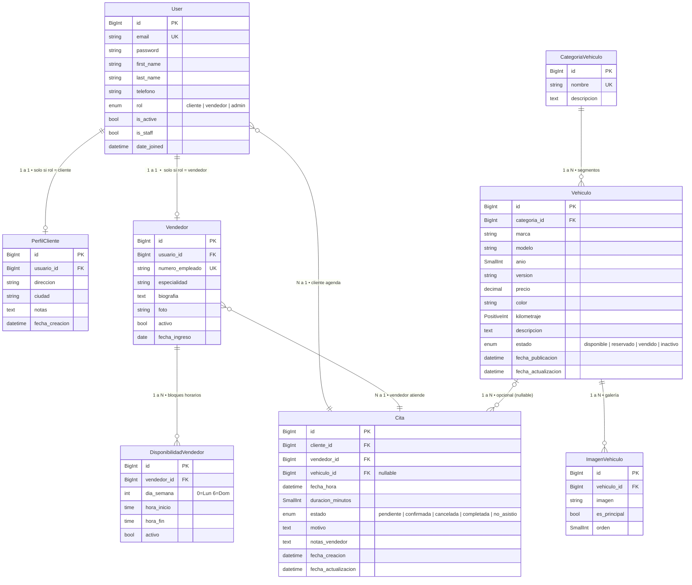
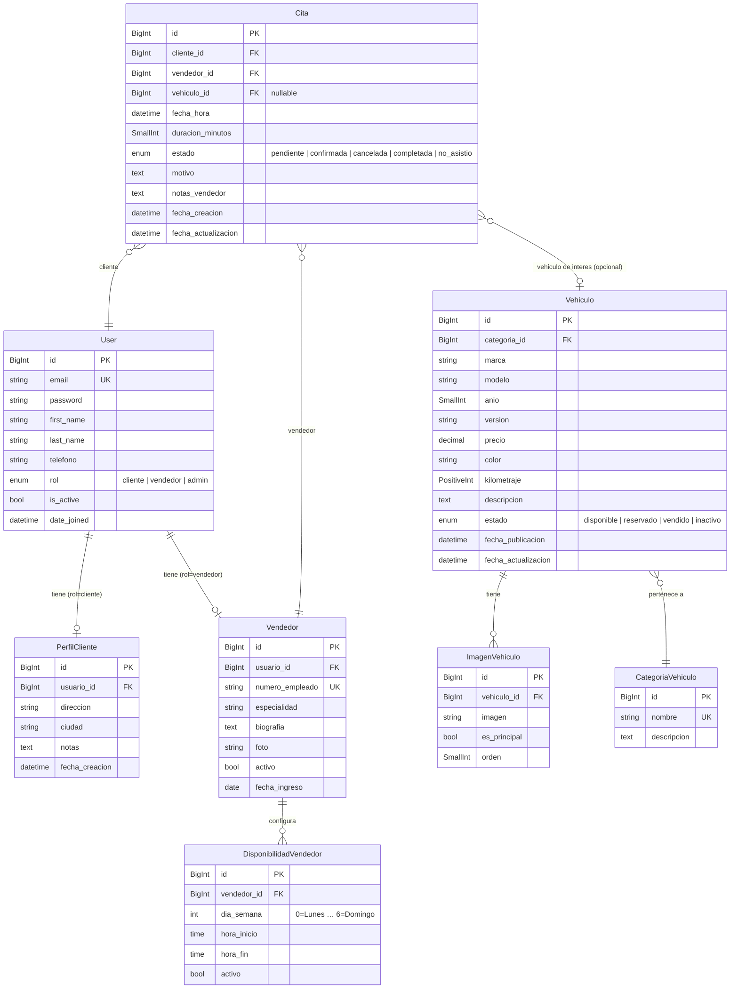

# Base de Datos — Modelos y Relaciones

> **Motor:** SQLite (desarrollo) / PostgreSQL (producción)  
> **ORM:** Django 4.2 — migraciones aplicadas  
> **Última actualización:** 2026-04-07

---

## Mapa de Relaciones General

```
┌─────────────────────────────────────────────────────────────────────────────┐
│                           MAPA DE RELACIONES                                │
├─────────────────────────────────────────────────────────────────────────────┤
│                                                                             │
│   ┌──────────┐  1:1 (rol=cliente)  ┌───────────────┐                       │
│   │          │────────────────────▶│  PerfilCliente │                       │
│   │          │                     └───────────────┘                       │
│   │   User   │                                                              │
│   │          │  1:1 (rol=vendedor) ┌───────────────┐   1:N  ┌────────────┐ │
│   │          │────────────────────▶│    Vendedor   │───────▶│Disponibili-│ │
│   └────┬─────┘                     └───────┬───────┘        │dad Vendedor│ │
│        │                                   │                └────────────┘ │
│        │ N:1 (como cliente)                │ N:1 (como vendedor)           │
│        │                                   │                               │
│        ▼                                   ▼                               │
│   ┌──────────────────────────────────────────┐                             │
│   │                   Cita                   │                             │
│   │   cliente_id (FK) · vendedor_id (FK)     │                             │
│   │   vehiculo_id (FK, nullable)             │                             │
│   └─────────────────────┬────────────────────┘                             │
│                          │ N:1 (opcional)                                   │
│                          ▼                                                  │
│                  ┌───────────────┐   N:1   ┌──────────────────┐            │
│                  │   Vehiculo    │────────▶│CategoriaVehiculo │            │
│                  │               │         └──────────────────┘            │
│                  │               │  1:N   ┌──────────────────┐             │
│                  │               │───────▶│  ImagenVehiculo  │             │
│                  └───────────────┘        └──────────────────┘             │
│                                                                             │
└─────────────────────────────────────────────────────────────────────────────┘
```

---

## Diagrama ER (Mermaid)



---

## Tabla Resumen de Relaciones

| Modelo origen              | Relación  | Modelo destino         | Campo FK       | on_delete  | Nullable | Descripción                                                |
|----------------------------|-----------|------------------------|----------------|------------|----------|------------------------------------------------------------|
| `PerfilCliente`            | **1 : 1** | `User`                 | `usuario`      | CASCADE    | No       | Un cliente tiene exactamente un perfil y viceversa         |
| `Vendedor`                 | **1 : 1** | `User`                 | `usuario`      | CASCADE    | No       | Un vendedor tiene exactamente un perfil y viceversa        |
| `Vehiculo`                 | **N : 1** | `CategoriaVehiculo`    | `categoria`    | PROTECT    | No       | Muchos vehículos pertenecen a una categoría                |
| `ImagenVehiculo`           | **N : 1** | `Vehiculo`             | `vehiculo`     | CASCADE    | No       | Muchas imágenes pertenecen a un vehículo                   |
| `DisponibilidadVendedor`   | **N : 1** | `Vendedor`             | `vendedor`     | CASCADE    | No       | Muchos bloques horarios pertenecen a un vendedor           |
| `Cita`                     | **N : 1** | `User` (cliente)       | `cliente`      | PROTECT    | No       | Muchas citas pueden pertenecer a un cliente                |
| `Cita`                     | **N : 1** | `Vendedor`             | `vendedor`     | PROTECT    | No       | Muchas citas pueden pertenecer a un vendedor               |
| `Cita`                     | **N : 1** | `Vehiculo`             | `vehiculo`     | SET_NULL   | **Sí**   | Una cita puede no tener vehículo de interés                |

> **Notación:** `1:1` uno a uno · `1:N` uno a muchos · `N:1` muchos a uno

---

## Detalle por App

---

### App `accounts`

---

#### `User` — Tabla: `accounts_user`

Modelo central del sistema. Extiende `AbstractUser` de Django.  
`USERNAME_FIELD = 'email'` — el email reemplaza al username como identificador de login.

```
accounts_user
┌──────────────────┬───────────────────────────┬──────────┬────────────────────────────────────┐
│ Campo            │ Tipo Django                │ BD       │ Notas                              │
├──────────────────┼───────────────────────────┼──────────┼────────────────────────────────────┤
│ id               │ BigAutoField               │ BIGINT   │ PK — autoincremental               │
│ email            │ EmailField                 │ VARCHAR  │ UNIQUE — identificador de login    │
│ password         │ CharField                  │ VARCHAR  │ Hash PBKDF2-SHA256 por Django      │
│ first_name       │ CharField(150)             │ VARCHAR  │ Nombre                             │
│ last_name        │ CharField(150)             │ VARCHAR  │ Apellido(s)                        │
│ telefono         │ CharField(20)              │ VARCHAR  │ Opcional                           │
│ rol              │ CharField(10) choices      │ VARCHAR  │ 'cliente' | 'vendedor' | 'admin'   │
│ is_active        │ BooleanField               │ BOOLEAN  │ Default: True                      │
│ is_staff         │ BooleanField               │ BOOLEAN  │ Acceso a Django Admin              │
│ is_superuser     │ BooleanField               │ BOOLEAN  │ Permisos totales                   │
│ date_joined      │ DateTimeField              │ DATETIME │ Auto al crear                      │
│ last_login       │ DateTimeField              │ DATETIME │ Auto al autenticar (nullable)      │
│ username         │ CharField(150)             │ VARCHAR  │ Heredado — no se usa para login    │
└──────────────────┴───────────────────────────┴──────────┴────────────────────────────────────┘
```

**Propiedades computadas (no columnas reales):**

| Propiedad         | Retorna                                      |
|-------------------|----------------------------------------------|
| `nombre_completo` | `first_name + ' ' + last_name` o `email`     |
| `es_cliente`      | `True` si `rol == 'cliente'`                 |
| `es_vendedor`     | `True` si `rol == 'vendedor'`                |
| `es_admin`        | `True` si `rol == 'admin'`                   |

**Relaciones de salida:**
```
User (1) ──────────────────── (0 o 1) PerfilCliente
           OneToOne / CASCADE — solo si rol = 'cliente'

User (1) ──────────────────── (0 o 1) Vendedor
           OneToOne / CASCADE — solo si rol = 'vendedor'

User (1) ──────────────────── (N) Cita   [como cliente]
           1 a muchos / PROTECT
```

---

#### `PerfilCliente` — Tabla: `accounts_perfilcliente`

Extiende `User` con datos adicionales exclusivos del cliente.  
Se crea automáticamente vía **signal** cuando `User.rol = 'cliente'`.

```
accounts_perfilcliente
┌──────────────────┬───────────────────────────┬──────────┬──────────────────────────────────────────┐
│ Campo            │ Tipo Django                │ BD       │ Notas                                    │
├──────────────────┼───────────────────────────┼──────────┼──────────────────────────────────────────┤
│ id               │ BigAutoField               │ BIGINT   │ PK                                       │
│ usuario_id       │ OneToOneField → User       │ BIGINT   │ FK UNIQUE — CASCADE al borrar User       │
│ direccion        │ CharField(255)             │ VARCHAR  │ Opcional                                 │
│ ciudad           │ CharField(100)             │ VARCHAR  │ Opcional                                 │
│ notas            │ TextField                  │ TEXT     │ Notas internas del sistema               │
│ fecha_creacion   │ DateTimeField              │ DATETIME │ Auto al crear                            │
└──────────────────┴───────────────────────────┴──────────┴──────────────────────────────────────────┘
```

**Relación:**
```
User (1) ─────────────────────────────── (0 o 1) PerfilCliente
         │  Tipo: OneToOne               │
         │  on_delete: CASCADE           │
         │  Solo existe si rol='cliente' │
         └───────────────────────────────┘
```

---

### App `autos`

---

#### `CategoriaVehiculo` — Tabla: `autos_categoriavehiculo`

Tabla de referencia (lookup). No tiene FK de salida — es el punto de partida de la rama de vehículos.

```
autos_categoriavehiculo
┌──────────────┬────────────────┬─────────┬─────────────────────────────────────┐
│ Campo        │ Tipo Django    │ BD      │ Notas                               │
├──────────────┼────────────────┼─────────┼─────────────────────────────────────┤
│ id           │ BigAutoField   │ BIGINT  │ PK                                  │
│ nombre       │ CharField(80)  │ VARCHAR │ UNIQUE — SUV, Pickup, Sedán, etc.   │
│ descripcion  │ TextField      │ TEXT    │ Opcional                            │
└──────────────┴────────────────┴─────────┴─────────────────────────────────────┘
```

**Relación de salida:**
```
CategoriaVehiculo (1) ─────────────────────── (N) Vehiculo
                       │  Tipo: ForeignKey     │
                       │  on_delete: PROTECT   │  ← no se puede borrar si tiene vehículos
                       └───────────────────────┘
```

---

#### `Vehiculo` — Tabla: `autos_vehiculo`

Inventario del catálogo de la agencia.

```
autos_vehiculo
┌──────────────────────┬────────────────────────────┬──────────────┬──────────────────────────────────────────────────────┐
│ Campo                │ Tipo Django                 │ BD           │ Notas                                                │
├──────────────────────┼────────────────────────────┼──────────────┼──────────────────────────────────────────────────────┤
│ id                   │ BigAutoField                │ BIGINT       │ PK                                                   │
│ categoria_id         │ ForeignKey → Categoria      │ BIGINT       │ FK — PROTECT al borrar categoría                     │
│ marca                │ CharField(80)               │ VARCHAR      │ Default: 'Ford'                                      │
│ modelo               │ CharField(100)              │ VARCHAR      │ Nombre del modelo (Ranger, Bronco…)                  │
│ anio                 │ PositiveSmallIntegerField   │ SMALLINT     │ Año del modelo                                       │
│ version              │ CharField(100)              │ VARCHAR      │ Opcional — XLT, Titanium, Raptor…                    │
│ precio               │ DecimalField(12,2)          │ DECIMAL      │ Precio en MXN                                        │
│ color                │ CharField(50)               │ VARCHAR      │ Opcional                                             │
│ kilometraje          │ PositiveIntegerField        │ INTEGER      │ Default: 0 (vehículo nuevo)                          │
│ descripcion          │ TextField                   │ TEXT         │ Opcional                                             │
│ estado               │ CharField(12) choices       │ VARCHAR      │ disponible | reservado | vendido | inactivo          │
│ fecha_publicacion    │ DateTimeField               │ DATETIME     │ Auto al crear                                        │
│ fecha_actualizacion  │ DateTimeField               │ DATETIME     │ Auto al guardar                                      │
└──────────────────────┴────────────────────────────┴──────────────┴──────────────────────────────────────────────────────┘
```

**Estados posibles del campo `estado`:**

| Valor        | Significado                              |
|--------------|------------------------------------------|
| `disponible` | En inventario, listo para vender         |
| `reservado`  | Apartado (cita activa)                   |
| `vendido`    | Transacción completada                   |
| `inactivo`   | Retirado del catálogo público            |

**Relaciones:**
```
CategoriaVehiculo (1) ──N:1── Vehiculo     Vehiculo pertenece a UNA categoría
                               on_delete: PROTECT

Vehiculo (1) ──1:N── ImagenVehiculo        Un vehículo tiene CERO o MUCHAS fotos
                      on_delete: CASCADE

Vehiculo (1) ──1:N── Cita  [nullable]      Un vehículo puede aparecer en MUCHAS citas
                      on_delete: SET_NULL   Si el vehículo se borra → vehiculo_id = NULL
```

**Propiedad computada:** `imagen_principal` — primer `ImagenVehiculo` con `es_principal=True`, o el primero de la lista.

---

#### `ImagenVehiculo` — Tabla: `autos_imagenvehiculo`

Galería de fotos de cada vehículo. Múltiples fotos por vehículo; una es la portada.

```
autos_imagenvehiculo
┌──────────────┬────────────────────────────┬─────────┬────────────────────────────────────────────┐
│ Campo        │ Tipo Django                 │ BD      │ Notas                                      │
├──────────────┼────────────────────────────┼─────────┼────────────────────────────────────────────┤
│ id           │ BigAutoField                │ BIGINT  │ PK                                         │
│ vehiculo_id  │ ForeignKey → Vehiculo       │ BIGINT  │ FK — CASCADE al borrar vehículo            │
│ imagen       │ ImageField                  │ VARCHAR │ Ruta física: media/autos/YYYY/MM/           │
│ es_principal │ BooleanField                │ BOOLEAN │ Default: False — marca la foto de portada  │
│ orden        │ PositiveSmallIntegerField   │ SMALLINT│ Default: 0 — orden de presentación         │
└──────────────┴────────────────────────────┴─────────┴────────────────────────────────────────────┘
```

**Orden por defecto Meta:** `-es_principal, orden` (principal siempre primero).

**Relación:**
```
Vehiculo (1) ─────────────────────────── (N) ImagenVehiculo
             │  Tipo: ForeignKey          │
             │  on_delete: CASCADE        │  ← se borran todas si se borra el vehículo
             └────────────────────────────┘
```

---

### App `vendedores`

---

#### `Vendedor` — Tabla: `vendedores_vendedor`

Perfil laboral del asesor de ventas, vinculado 1:1 a un `User` con `rol=vendedor`.  
Se crea automáticamente vía **signal** cuando `User.rol = 'vendedor'`.

```
vendedores_vendedor
┌──────────────────┬────────────────────────────┬─────────┬──────────────────────────────────────────┐
│ Campo            │ Tipo Django                 │ BD      │ Notas                                    │
├──────────────────┼────────────────────────────┼─────────┼──────────────────────────────────────────┤
│ id               │ BigAutoField                │ BIGINT  │ PK                                       │
│ usuario_id       │ OneToOneField → User        │ BIGINT  │ FK UNIQUE — CASCADE al borrar User       │
│ numero_empleado  │ CharField(20)               │ VARCHAR │ UNIQUE — identificador interno (EMP-001) │
│ especialidad     │ CharField(120)              │ VARCHAR │ Opcional — SUVs, Pickups, Eléctricos…    │
│ biografia        │ TextField                   │ TEXT    │ Opcional — bio pública                   │
│ foto             │ ImageField                  │ VARCHAR │ Ruta: media/vendedores/                  │
│ activo           │ BooleanField                │ BOOLEAN │ Default: True — disponible para citas    │
│ fecha_ingreso    │ DateField                   │ DATE    │ Fecha de contratación                    │
└──────────────────┴────────────────────────────┴─────────┴──────────────────────────────────────────┘
```

**Relaciones:**
```
User (1) ─────────────────────────────── (0 o 1) Vendedor
         │  Tipo: OneToOne               │
         │  on_delete: CASCADE           │
         │  Solo existe si rol='vendedor'│
         └───────────────────────────────┘

Vendedor (1) ─────────────────────────── (N) DisponibilidadVendedor
             │  Tipo: ForeignKey          │
             │  on_delete: CASCADE        │
             └────────────────────────────┘

Vendedor (1) ─────────────────────────── (N) Cita
             │  Tipo: ForeignKey          │
             │  on_delete: PROTECT        │  ← no se puede borrar vendedor con citas
             └────────────────────────────┘
```

---

#### `DisponibilidadVendedor` — Tabla: `vendedores_disponibilidadvendedor`

Bloques de tiempo en que el vendedor acepta citas. Un vendedor puede tener múltiples bloques por día.

```
vendedores_disponibilidadvendedor
┌──────────────┬────────────────────────────┬─────────┬──────────────────────────────────────────────┐
│ Campo        │ Tipo Django                 │ BD      │ Notas                                        │
├──────────────┼────────────────────────────┼─────────┼──────────────────────────────────────────────┤
│ id           │ BigAutoField                │ BIGINT  │ PK                                           │
│ vendedor_id  │ ForeignKey → Vendedor       │ BIGINT  │ FK — CASCADE al borrar vendedor              │
│ dia_semana   │ IntegerField choices        │ INTEGER │ 0=Lunes  1=Martes  …  6=Domingo              │
│ hora_inicio  │ TimeField                   │ TIME    │ Inicio del bloque (HH:MM)                    │
│ hora_fin     │ TimeField                   │ TIME    │ Fin del bloque (HH:MM)                       │
│ activo       │ BooleanField                │ BOOLEAN │ Default: True — bloque habilitado            │
└──────────────┴────────────────────────────┴─────────┴──────────────────────────────────────────────┘
```

**Constraint a nivel de base de datos:**
```sql
CHECK (hora_fin > hora_inicio)   -- nombre: hora_fin_mayor_que_inicio
```

**Relación:**
```
Vendedor (1) ─────────────────────────── (N) DisponibilidadVendedor
             │  Tipo: ForeignKey          │
             │  on_delete: CASCADE        │  ← se borran todos si se borra el vendedor
             └────────────────────────────┘
```

---

### App `citas`

---

#### `Cita` — Tabla: `citas_cita`

Núcleo del sistema. Registra la reunión entre un cliente y un vendedor.

```
citas_cita
┌──────────────────────┬────────────────────────────┬──────────────┬──────────────────────────────────────────────────────────┐
│ Campo                │ Tipo Django                 │ BD           │ Notas                                                    │
├──────────────────────┼────────────────────────────┼──────────────┼──────────────────────────────────────────────────────────┤
│ id                   │ BigAutoField                │ BIGINT       │ PK                                                       │
│ cliente_id           │ ForeignKey → User           │ BIGINT       │ FK — PROTECT · limit_choices: rol=cliente                │
│ vendedor_id          │ ForeignKey → Vendedor       │ BIGINT       │ FK — PROTECT                                             │
│ vehiculo_id          │ ForeignKey → Vehiculo       │ BIGINT       │ FK — SET_NULL · NULL=True ← vehículo opcional            │
│ fecha_hora           │ DateTimeField               │ DATETIME     │ Fecha y hora exacta de la cita                           │
│ duracion_minutos     │ PositiveSmallIntegerField   │ SMALLINT     │ Default: 60                                              │
│ estado               │ CharField(12) choices       │ VARCHAR      │ pendiente|confirmada|cancelada|completada|no_asistio     │
│ motivo               │ TextField                   │ TEXT         │ Opcional — descripción del cliente                       │
│ notas_vendedor       │ TextField                   │ TEXT         │ Opcional — notas internas post-cita                      │
│ fecha_creacion       │ DateTimeField               │ DATETIME     │ Auto al crear                                            │
│ fecha_actualizacion  │ DateTimeField               │ DATETIME     │ Auto al guardar                                          │
└──────────────────────┴────────────────────────────┴──────────────┴──────────────────────────────────────────────────────────┘
```

**Estados y transiciones posibles:**

```
            ┌─────────────┐
  [crear]──▶│  PENDIENTE  │──────────────────────────────────▶ CANCELADA
            └──────┬──────┘
                   │ vendedor/admin confirma
                   ▼
            ┌─────────────┐
            │ CONFIRMADA  │──── vendedor/admin completa ────▶ COMPLETADA
            └──────┬──────┘
                   │ nadie asistió
                   ▼
               NO_ASISTIO
```

| Estado       | Quién puede establecerlo            |
|--------------|-------------------------------------|
| `pendiente`  | Sistema al crear la cita            |
| `confirmada` | Vendedor o Admin                    |
| `cancelada`  | Cliente, Vendedor o Admin           |
| `completada` | Vendedor o Admin                    |
| `no_asistio` | Vendedor o Admin                    |

**Constraint de unicidad a nivel BD:**
```sql
UNIQUE (vendedor_id, fecha_hora)   -- nombre: cita_unica_vendedor_fecha_hora
-- Un vendedor no puede tener dos citas en el mismo momento exacto
```

**Comportamiento de cada FK al borrar el registro referenciado:**

| FK            | on_delete  | Efecto en `Cita`                               |
|---------------|------------|------------------------------------------------|
| `cliente_id`  | `PROTECT`  | No se puede borrar el User si tiene citas      |
| `vendedor_id` | `PROTECT`  | No se puede borrar el Vendedor si tiene citas  |
| `vehiculo_id` | `SET_NULL` | Si se borra el Vehiculo → campo queda `NULL`   |

**Relaciones entrantes:**
```
User (cliente) (1) ──1:N── (N) Cita     un cliente puede tener MUCHAS citas
                                         on_delete: PROTECT

Vendedor       (1) ──1:N── (N) Cita     un vendedor puede atender MUCHAS citas
                                         on_delete: PROTECT

Vehiculo       (1) ──1:N── (N) Cita     un vehículo puede aparecer en MUCHAS citas
                  [nullable]             on_delete: SET_NULL
```

**Propiedad computada:**

| Propiedad     | Retorna                                           |
|---------------|---------------------------------------------------|
| `esta_activa` | `True` si `estado` es `pendiente` o `confirmada`  |

---

## Constraints y Reglas de Integridad Completas

| Tabla                               | Nombre del constraint               | Tipo             | Regla                                                          |
|-------------------------------------|-------------------------------------|------------------|----------------------------------------------------------------|
| `accounts_user`                     | *(índice automático)*               | UNIQUE INDEX     | `email` único en todo el sistema                               |
| `accounts_perfilcliente`            | *(ForeignKey OneToOne)*             | UNIQUE FK        | Un solo `PerfilCliente` por `User`                            |
| `vendedores_vendedor`               | *(ForeignKey OneToOne)*             | UNIQUE FK        | Un solo `Vendedor` por `User`                                 |
| `vendedores_vendedor`               | *(índice automático)*               | UNIQUE INDEX     | `numero_empleado` único                                        |
| `autos_categoriavehiculo`           | *(índice automático)*               | UNIQUE INDEX     | `nombre` de categoría único                                    |
| `vendedores_disponibilidadvendedor` | `hora_fin_mayor_que_inicio`         | CHECK            | `hora_fin > hora_inicio`                                       |
| `citas_cita`                        | `cita_unica_vendedor_fecha_hora`    | UNIQUE TOGETHER  | `(vendedor_id, fecha_hora)` únicos — sin doble-booking         |

---

## Cascadas y Efectos en Cadena

```
Si se borra un User (cliente):
  └── PROTECT → error si tiene Citas como cliente

Si se borra un User (vendedor):
  └── CASCADE → borra su Vendedor
       └── CASCADE → borra sus DisponibilidadVendedor
       └── PROTECT → error si tiene Citas asignadas

Si se borra un Vehiculo:
  └── CASCADE → borra todas sus ImagenVehiculo
  └── SET_NULL → citas.vehiculo_id = NULL

Si se borra una CategoriaVehiculo:
  └── PROTECT → error si tiene Vehiculos asignados

Si se borra un Vendedor:
  └── CASCADE → borra sus DisponibilidadVendedor
  └── PROTECT → error si tiene Citas asignadas
```

---

## Diagrama Entidad-Relación



---

## App: `accounts`

### `User` (modelo customizado — `AUTH_USER_MODEL`)

Extiende `AbstractUser`. El campo `email` es el identificador único de login
(`USERNAME_FIELD = 'email'`).

| Campo          | Tipo                    | Descripción                                  |
|----------------|-------------------------|----------------------------------------------|
| `id`           | `BigAutoField` (PK)     | Clave primaria automática                    |
| `email`        | `EmailField` (unique)   | Identificador de login                       |
| `password`     | `CharField` (hash)      | Contraseña hasheada por Django               |
| `first_name`   | `CharField(150)`        | Nombre                                       |
| `last_name`    | `CharField(150)`        | Apellido(s)                                  |
| `telefono`     | `CharField(20)`         | Teléfono de contacto (opcional)              |
| `rol`          | `CharField(choices)`    | `cliente` / `vendedor` / `admin`             |
| `is_active`    | `BooleanField`          | Activo en el sistema                         |
| `is_staff`     | `BooleanField`          | Acceso al panel de administración            |
| `date_joined`  | `DateTimeField`         | Fecha de registro                            |

**Propiedades de instancia:** `nombre_completo`, `es_cliente`, `es_vendedor`, `es_admin`.

---

### `PerfilCliente`

Información adicional para usuarios con `rol=cliente`. Se crea junto al User.

| Campo            | Tipo                | Descripción                          |
|------------------|---------------------|--------------------------------------|
| `id`             | `BigAutoField` (PK) |                                      |
| `usuario`        | `OneToOneField`     | → `accounts.User`                    |
| `direccion`      | `CharField(255)`    | Dirección postal (opcional)          |
| `ciudad`         | `CharField(100)`    | Ciudad (opcional)                    |
| `notas`          | `TextField`         | Notas internas (opcional)            |
| `fecha_creacion` | `DateTimeField`     | Auto al crear                        |

---

## App: `autos`

### `CategoriaVehiculo`

Catálogo de segmentos (SUV, Sedan, Pickup, etc.).

| Campo         | Tipo                | Descripción              |
|---------------|---------------------|--------------------------|
| `id`          | `BigAutoField` (PK) |                          |
| `nombre`      | `CharField(80)`     | Nombre único del segmento|
| `descripcion` | `TextField`         | Descripción opcional     |

---

### `Vehiculo`

Vehículo del inventario de la agencia.

| Campo                 | Tipo                    | Descripción                                 |
|-----------------------|-------------------------|---------------------------------------------|
| `id`                  | `BigAutoField` (PK)     |                                             |
| `categoria`           | `ForeignKey` (PROTECT)  | → `CategoriaVehiculo`                       |
| `marca`               | `CharField(80)`         | Default: `Ford`                             |
| `modelo`              | `CharField(100)`        | Nombre del modelo (Ranger, Bronco, etc.)    |
| `anio`                | `PositiveSmallIntegerField` | Año del modelo                          |
| `version`             | `CharField(100)`        | Sub-versión (XLT, Titanium…)                |
| `precio`              | `DecimalField(12,2)`    | Precio en moneda local                      |
| `color`               | `CharField(50)`         | Color (opcional)                            |
| `kilometraje`         | `PositiveIntegerField`  | 0 para nuevos                               |
| `descripcion`         | `TextField`             | Descripción libre (opcional)                |
| `estado`              | `CharField(choices)`    | `disponible` / `reservado` / `vendido` / `inactivo` |
| `fecha_publicacion`   | `DateTimeField`         | Auto al crear                               |
| `fecha_actualizacion` | `DateTimeField`         | Auto al guardar                             |

**Propiedad:** `imagen_principal` → primera `ImagenVehiculo` con `es_principal=True`.

---

### `ImagenVehiculo`

Fotos asociadas a un vehículo. Una puede ser principal (portada).

| Campo         | Tipo                   | Descripción                      |
|---------------|------------------------|----------------------------------|
| `id`          | `BigAutoField` (PK)    |                                  |
| `vehiculo`    | `ForeignKey` (CASCADE) | → `Vehiculo`                     |
| `imagen`      | `ImageField`           | Sube a `media/autos/YYYY/MM/`    |
| `es_principal`| `BooleanField`         | Foto de portada                  |
| `orden`       | `PositiveSmallIntegerField` | Orden de visualización       |

---

## App: `vendedores`

### `Vendedor`

Perfil laboral del asesor de ventas.

| Campo             | Tipo                   | Descripción                          |
|-------------------|------------------------|--------------------------------------|
| `id`              | `BigAutoField` (PK)    |                                      |
| `usuario`         | `OneToOneField`        | → `accounts.User` (rol=vendedor)     |
| `numero_empleado` | `CharField(20)` unique | Identificador interno                |
| `especialidad`    | `CharField(120)`       | Línea de vehículos (opcional)        |
| `biografia`       | `TextField`            | Bio visible (opcional)               |
| `foto`            | `ImageField`           | Sube a `media/vendedores/`           |
| `activo`          | `BooleanField`         | Disponible para recibir citas        |
| `fecha_ingreso`   | `DateField`            | Fecha de contratación                |

---

### `DisponibilidadVendedor`

Bloques de horario en que el vendedor acepta citas.

| Campo         | Tipo                  | Descripción                                         |
|---------------|-----------------------|-----------------------------------------------------|
| `id`          | `BigAutoField` (PK)   |                                                     |
| `vendedor`    | `ForeignKey` (CASCADE)| → `Vendedor`                                        |
| `dia_semana`  | `IntegerField`        | 0=Lunes … 6=Domingo                                 |
| `hora_inicio` | `TimeField`           | Inicio del bloque                                   |
| `hora_fin`    | `TimeField`           | Fin del bloque                                      |
| `activo`      | `BooleanField`        | Si el bloque está habilitado                        |

**Constraint:** `hora_fin > hora_inicio` (a nivel base de datos).

---

## App: `citas`

### `Cita`

Reserva de una reunión entre un cliente y un vendedor.

| Campo                 | Tipo                    | Descripción                                              |
|-----------------------|-------------------------|----------------------------------------------------------|
| `id`                  | `BigAutoField` (PK)     |                                                          |
| `cliente`             | `ForeignKey` (PROTECT)  | → `accounts.User` (rol=cliente)                          |
| `vendedor`            | `ForeignKey` (PROTECT)  | → `vendedores.Vendedor`                                  |
| `vehiculo`            | `ForeignKey` (SET_NULL) | → `autos.Vehiculo` (nullable — interés opcional)         |
| `fecha_hora`          | `DateTimeField`         | Fecha y hora de la cita                                  |
| `duracion_minutos`    | `PositiveSmallIntegerField` | Default 60 minutos                                   |
| `estado`              | `CharField(choices)`    | `pendiente` / `confirmada` / `cancelada` / `completada` / `no_asistio` |
| `motivo`              | `TextField`             | Descripción del cliente (opcional)                       |
| `notas_vendedor`      | `TextField`             | Notas post-cita del vendedor (opcional)                  |
| `fecha_creacion`      | `DateTimeField`         | Auto al crear                                            |
| `fecha_actualizacion` | `DateTimeField`         | Auto al guardar                                          |

**Constraint:** `(vendedor, fecha_hora)` únicas — no se puede sobreponer una cita exacta.  
**Propiedad:** `esta_activa` → `True` si estado es `pendiente` o `confirmada`.
