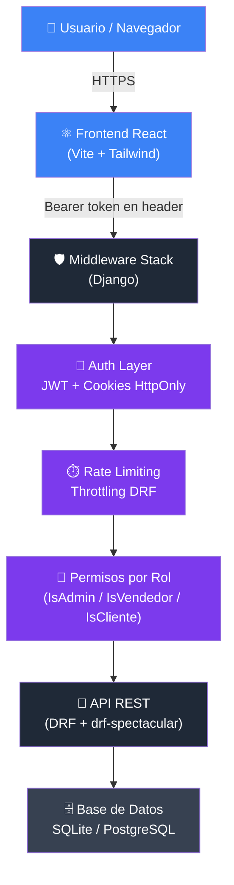
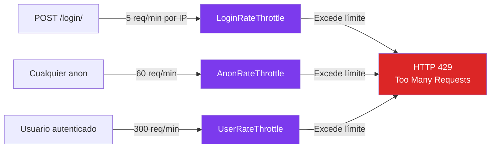
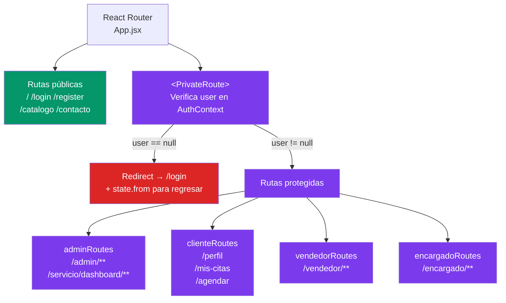

# Seguridad — Ford Guerrero App

> Aplicación Django 4.2 + React 18. Documento actualizado al 21 de abril de 2026.

---

## Mapa general de capas de seguridad



---

## 1. Autenticación y Tokens JWT

### Estrategia de tokens (protección XSS)

```mermaid
sequenceDiagram
    participant B as Navegador
    participant API as Backend API
    participant C as Cookie HttpOnly

    B->>API: POST /api/accounts/login/\n{email, password}
    API-->>B: Body → {access: "..."}  ← token de 15 min
    API-->>C: Set-Cookie: ford_refresh=...\nHttpOnly; SameSite=Strict; Secure

    Note over B: ✅ access token en memoria React\n❌ nunca en localStorage

    B->>API: GET /api/citas/\nAuthorization: Bearer {access}
    API-->>B: 200 OK

    B->>API: POST /api/accounts/refresh/ + Cookie automática
    API-->>B: {access: "nuevo_token"}
    API-->>C: Rota cookie ford_refresh

    B->>API: POST /api/accounts/logout/ + Cookie
    API-->>C: Delete-Cookie ford_refresh
    API-->>B: {detail: "Sesión cerrada"}
```

### Configuración de tokens

| Parámetro | Valor | Propósito |
|---|---|---|
| `ACCESS_TOKEN_LIFETIME` | 15 minutos | Ventana de exposición mínima |
| `REFRESH_TOKEN_LIFETIME` | 1 día | Sesión razonable para usuarios |
| `ROTATE_REFRESH_TOKENS` | `True` | Cada refresh genera un nuevo token |
| Cookie `ford_refresh` | `HttpOnly: True` | Inaccesible por JavaScript (anti-XSS) |
| Cookie `SameSite` | `Strict` | Bloquea CSRF cross-site |
| Cookie `Secure` | `True` en producción | Solo se envía por HTTPS |
| Cookie `path` | `/api/accounts/` | Scope reducido, no se envía en otras rutas |

### Access token en memoria (anti-XSS)

```jsx
// frontend/src/context/AuthContext.jsx
// ✅ Estado React — no persiste en disco, JS malicioso no lo alcanza
const [accessToken, setAccessToken] = useState(null)

// Al iniciar: restaura sesión desde la cookie HttpOnly (no localStorage)
useEffect(() => {
  fetch('/api/accounts/refresh/', {
    method: 'POST',
    credentials: 'include',  // envía ford_refresh automáticamente
  })
  .then(res => res.json())
  .then(({ access }) => setAccessToken(access))
}, [])
```

---

## 2. Protección contra fuerza bruta (Rate Limiting)



```python
# backend/fordapp/settings.py
REST_FRAMEWORK = {
    'DEFAULT_THROTTLE_CLASSES': [
        'rest_framework.throttling.AnonRateThrottle',
        'rest_framework.throttling.UserRateThrottle',
    ],
    'DEFAULT_THROTTLE_RATES': {
        'anon':  '60/minute',
        'user':  '300/minute',
        'login': '5/minute',   # ← clave para anti-brute-force
    },
}
```

---

## 3. Rutas protegidas por rol

### Backend — permisos personalizados

| Clase de permiso | Rol requerido | Ejemplo de uso |
|---|---|---|
| `IsAuthenticated` | Cualquier usuario logueado | `GET /api/autos/vehiculos/` |
| `IsCliente` | `rol == 'cliente'` | Agendar citas propias |
| `IsVendedor` | `rol == 'vendedor'` | Gestión de inventario |
| `IsAdmin` | `rol == 'admin'` | Panel de usuarios, estadísticas |
| `IsVendedorOrAdmin` | `vendedor` o `admin` | Edición de vehículos |
| `IsOwnerOrAdmin` | Dueño del objeto o admin | Ver/editar objetos propios |
| `AllowAny` | Público | `register/`, `login/`, catálogo público |

### Frontend — rutas privadas



```jsx
// frontend/src/components/PrivateRoute.jsx
export default function PrivateRoute({ children }) {
  const { user, loading } = useAuth()
  if (loading) return <Spinner />
  if (!user) return <Navigate to="/login" state={{ from: location.pathname }} replace />
  return children
}
```

---

## 4. Validación de contraseñas

Django valida la contraseña en el momento del registro con cuatro reglas simultáneas:

| Validador | Descripción |
|---|---|
| `UserAttributeSimilarityValidator` | No puede parecerse al email o nombre |
| `MinimumLengthValidator` | Mínimo 8 caracteres |
| `CommonPasswordValidator` | Rechaza las 20,000 contraseñas más comunes |
| `NumericPasswordValidator` | No puede ser solo números |

```python
# RegisterSerializer — contraseña nunca se serializa de vuelta
password = serializers.CharField(write_only=True, validators=[validate_password])
```

---

## 5. Cabeceras de seguridad HTTP

| Cabecera | Valor | Protege contra |
|---|---|---|
| `X-Content-Type-Options` | `nosniff` | MIME sniffing |
| `Referrer-Policy` | `strict-origin-when-cross-origin` | Fuga de URLs en referer |
| `Cross-Origin-Opener-Policy` | `same-origin` | Ataques Spectre / cross-origin leaks |
| `X-Frame-Options` | `DENY` (middleware Django) | Clickjacking |
| `HSTS` | 31536000s + preload (producción) | Downgrade a HTTP |
| `SSL Redirect` | Activo en producción | Conexiones sin cifrar |

```python
# Activos en todos los entornos
SECURE_CONTENT_TYPE_NOSNIFF = True
SECURE_REFERRER_POLICY = 'strict-origin-when-cross-origin'
SECURE_CROSS_ORIGIN_OPENER_POLICY = 'same-origin'

# Solo producción (DEBUG=False)
SECURE_HSTS_SECONDS = 31536000
SECURE_HSTS_INCLUDE_SUBDOMAINS = True
SECURE_HSTS_PRELOAD = True
SECURE_SSL_REDIRECT = True
SESSION_COOKIE_SECURE = True
CSRF_COOKIE_SECURE = True
```

---

## 6. Protección contra inyección SQL

Django ORM genera queries parametrizadas automáticamente. El proyecto **nunca usa `raw()` ni `cursor.execute()` con interpolación de strings**.

```python
# ✅ ORM siempre parametrizado
CitaServicio.objects.filter(placas=placas)

# ✅ Lookups via filtros tipados
User.objects.get(email=email)
```

---

## 7. Protección CSRF

| Mecanismo | Estado |
|---|---|
| `CsrfViewMiddleware` activo | ✅ |
| Cookie `ford_refresh` con `SameSite=Strict` | ✅ Bloquea CSRF en refresh |
| API REST autenticada por header `Authorization: Bearer` | ✅ Inmune a CSRF (no usa cookies de sesión) |
| `CSRF_COOKIE_SECURE=True` en producción | ✅ |

---

## 8. CORS

Solo los orígenes configurados en `.env` pueden hacer requests con credenciales:

```python
CORS_ALLOWED_ORIGINS = config('CORS_ALLOWED_ORIGINS', default='http://localhost:5173', cast=Csv())
CORS_ALLOW_CREDENTIALS = True  # requerido para enviar la cookie ford_refresh
```

En producción, `CORS_ALLOWED_ORIGINS` debe contener **únicamente** el dominio de la aplicación.

---

## 9. Gestión de secretos

| Secreto | Almacenamiento | Notas |
|---|---|---|
| `SECRET_KEY` | `.env` (python-decouple) | Rotada. Nunca en código fuente |
| `DB_PASSWORD` | `.env` | |
| `CORS_ALLOWED_ORIGINS` | `.env` | Separado por comas |
| JWT tokens | Memoria React / Cookie HttpOnly | Nunca en localStorage |

```
# .env — NO incluir en control de versiones
SECRET_KEY=<clave aleatoria de 50+ chars>
DEBUG=False
DB_ENGINE=django.db.backends.postgresql
DB_PASSWORD=<password seguro>
CORS_ALLOWED_ORIGINS=https://mi-dominio.com
```

---

## 10. Resumen OWASP 

| # | Vulnerabilidad | Estado |
|---|---|---|
| A01 — Broken Access Control | ✅ Permisos por rol en cada ViewSet + `PrivateRoute` en frontend |
| A02 — Cryptographic Failures | ✅ HTTPS forzado en prod, cookies `Secure`, JWT RS256 disponible |
| A03 — Injection | ✅ ORM parametrizado, sin SQL crudo |
| A04 — Insecure Design | ✅ Refresh token en cookie HttpOnly, acceso mínimo por rol |
| A05 — Security Misconfiguration | ✅ `SECRET_KEY` en `.env`, cabeceras HTTP configuradas |
| A06 — Vulnerable Components | ⚠️ Revisar periódicamente con `pip-audit` y `npm audit` |
| A07 — Auth Failures | ✅ Rate limit 5/min en login, rotate refresh tokens |
| A08 — Software Integrity | ⚠️ Agregar checksums a dependencias en CI/CD |
| A09 — Logging & Monitoring | ✅ Django logging configurado (INFO en requests, WARNING en DB) |
| A10 — SSRF | ✅ No hay endpoints que hagan fetch a URLs externas por input del usuario |
